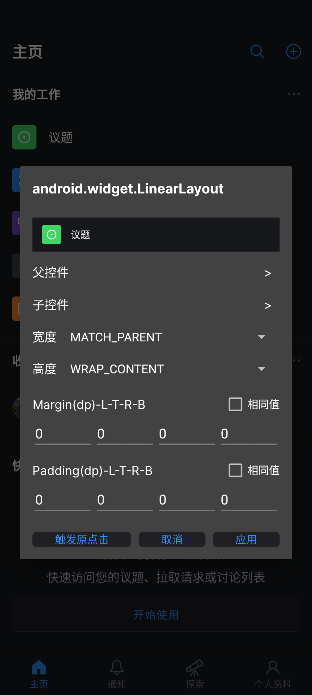
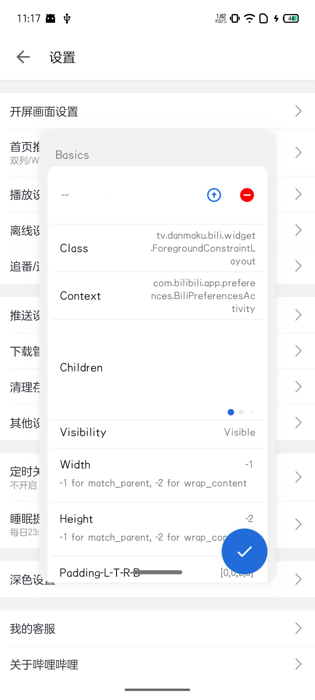
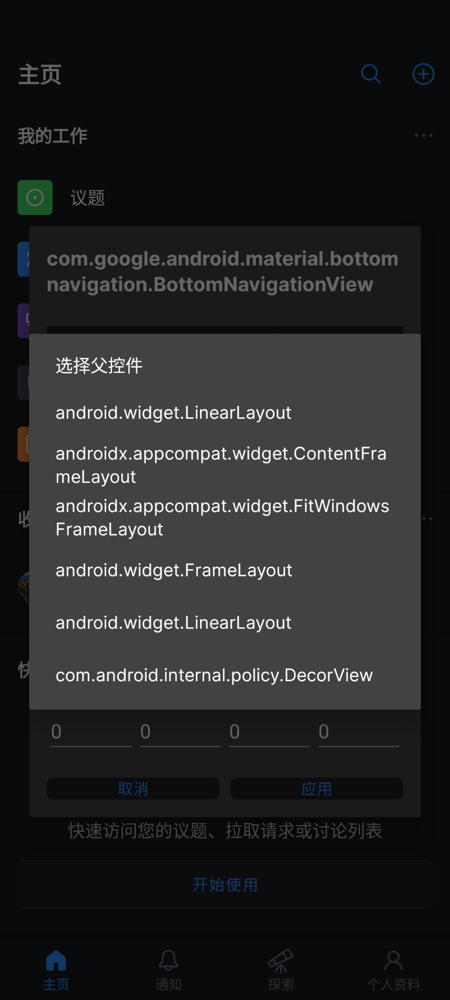
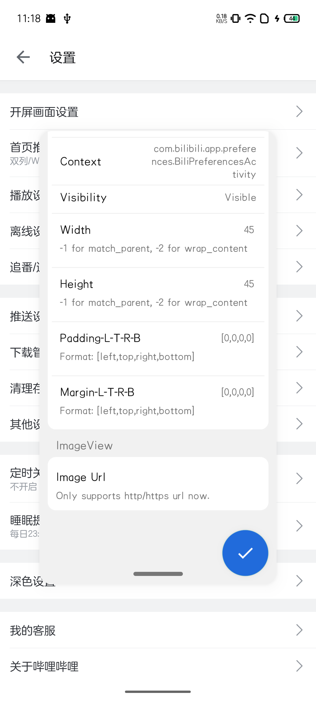

# AnyDebug

English | [简体中文](README_CN.md)

[](https://github.com/Xposed-Modules-Repo/com.hhvvg.anydebug/releases)

Change your view attributes without restarting your application.

# About

This software relies on the [Xposed Framework](https://github.com/rovo89/Xposed), For more API details, visit their [website](https://api.xposed.info/).

# Features

+ Touch screen to select views, instead of clicking it, this is far more convenient
+ Remove view
+ Change views' visibility
+ Change views' sizes
+ Change views' layout margin/padding
+ Change text of a `TextView`
+ Change text size
+ Change image, but currently only supports image url.
+ Properties viewer.
+ May be more...

# TODO

+ Extract as a libracy for integrating into apps for debugging purpose.

# Usage

## Install this app

Just download and install it from the latest [releases page](https://github.com/gitofleonardo/AnyDebug/releases/latest).

## Check apps

Check apps you want to hook in `LSPosed` or other `xposed` framework. Don't forget to force stop it before using.

## Mini window

A mini window shows the preview, selection switch, and the bottom drag bar inside.

+ Click the preview to enter details page.
+ Check the selection switch to start view selection. When this is on, touching on screen will select the nearest views from your touch point.
+ Press the bottom drag bar then you can move the mini window to other positions.

## Details page

Details page shows basic information and modification control. After modifing views' attributes, click the floating button below to confirm.

## Properties page

The entry is `Details page` -> `Properties`, which shows all exported properties in a view. These properties are annotated with `ViewDebug.ExportedProperty`.

## Quick setting

Add the quick setting button to notification control panel, you can toggle the state of the hook.

## Max window

When the window is maximized, just drag the bottom bar and fling it to turn it back into a mini window.

# Sample

|  |  |  |  |
| -- | -- | -- | -- |

# Sponsor

Give a free star to be a sponsor if you like this project.

# Stargazers over time

[](https://starchart.cc/gitofleonardo/AnyDebug)

# License

```
Copyright (C) <2024>  <gitofleonardo>

This program is free software: you can redistribute it and/or modify
it under the terms of the GNU General Public License as published by
the Free Software Foundation, either version 3 of the License, or
(at your option) any later version.

This program is distributed in the hope that it will be useful,
but WITHOUT ANY WARRANTY; without even the implied warranty of
MERCHANTABILITY or FITNESS FOR A PARTICULAR PURPOSE.  See the
GNU General Public License for more details.

You should have received a copy of the GNU General Public License
along with this program.  If not, see <https://www.gnu.org/licenses/>.
```