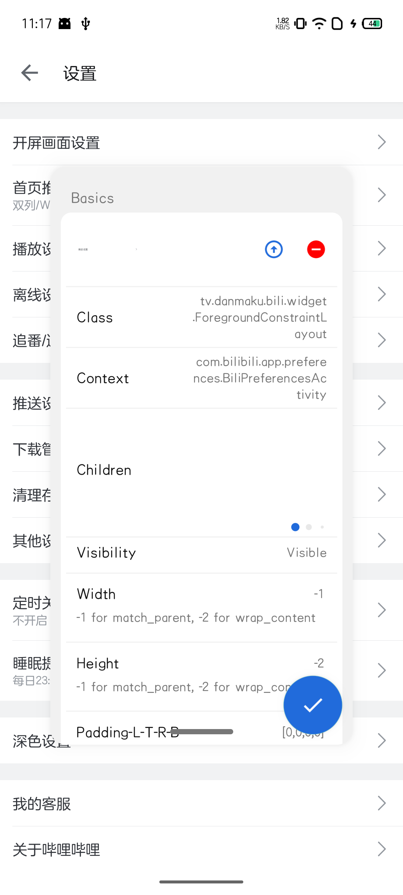
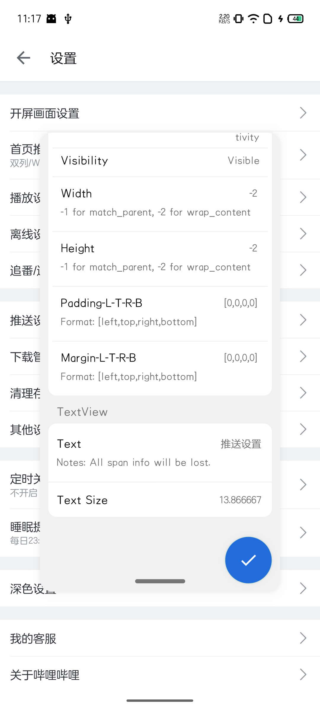
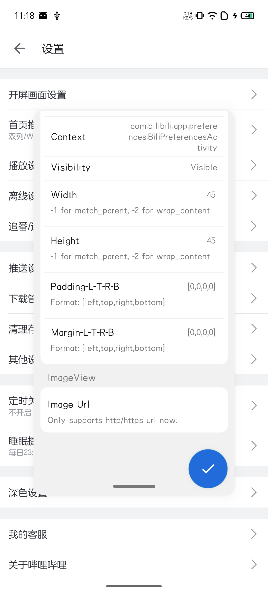

# AnyDebug

[English](README.md) | 简体中文

[](https://github.com/Xposed-Modules-Repo/com.hhvvg.anydebug/releases)

不需要重启应用，就可以更改View的参数。

# 关于

本应用依赖于[Xposed框架](https://github.com/rovo89/Xposed)。需要获取更多关于这个框架的信息，请访问他们的[官网](https://api.xposed.info/)。

# 特性

+ 触摸屏幕来选择 `View`，而不是通过点击，这会更加方便
+ 删掉 `View`
+ 更改 `View` 的可见性
+ 更改 `View` 的大小
+ 更改 `View` 的边距/内边距
+ 更改 `TextView` 的文本内容
+ 更改文本大小
+ 更改 `ImageView` 的图片内容，但目前仅支持链接形式的图片
+ 属性查看器
+ 或许还有更多...

# 待办

+ 提取为一个库，用来集成进应用里调试用于调试

# 用法

## 安装此应用

只需要从[发行页面](https://github.com/gitofleonardo/AnyDebug/releases/latest)中获取最新的安装包，然后安装即可。

## 勾选应用

在 `LSPosed` 或者是其他的 `xposed` 框架中勾选你需要 hook 的应用。勾选完成后不要忘了强行停止应用以使 hook 生效。

## 迷你窗口

迷你窗口展示了 `View` 的预览, 选择开关, 以及底部的拖动条.

+ 点击预览以进入 `View` 的详情页
+ 打开选择开关来开始选择 `View`。当开关打开的时候，触摸屏幕可以获取距离触摸点最近的所有 `View`
+ 按住底部拖动条并拖动，就可以移动迷你窗口在屏幕上的位置

## 详情页

详情页展示了 `View` 的基础信息，以及编辑控制. 在编辑完成信息之后，点击下方的悬浮按钮即可应用变更。

## 属性页

入口在 `详情页` -> `Properties` 处, 显示了该 `View` 所有的对外属性. 这些属性通常是带了 `ViewDebug.ExportedProperty` 注解的。

## 最大化窗口

当窗口被最大化之后，只需要拖动底部的拖拽条并甩动，即可最小化窗口。

## 快速设置

通过在控制面板中添加快捷开关按钮，你可以控制 hook 的开关状态。

# 示例

|  |  |  |  |
| -- | -- | -- | -- |

# 捐赠

如果你喜欢本项目的话，给个star支持一下就可以了。

# License

```
Copyright (C) <2024>  <gitofleonardo>

This program is free software: you can redistribute it and/or modify
it under the terms of the GNU General Public License as published by
the Free Software Foundation, either version 3 of the License, or
(at your option) any later version.

This program is distributed in the hope that it will be useful,
but WITHOUT ANY WARRANTY; without even the implied warranty of
MERCHANTABILITY or FITNESS FOR A PARTICULAR PURPOSE.  See the
GNU General Public License for more details.

You should have received a copy of the GNU General Public License
along with this program.  If not, see <https://www.gnu.org/licenses/>.
```